# Mobile-Programming-Project

# BookApp 📚 
                                   

This mobile application is designed to facilitate book management for libraries or bookstores. Users can browse a list of books, view brief descriptions, admins can perform actions like editing and deleting books.  Here's an overview of the key features and functionalities implemented in this project:

## Key Features:

### User Authentication:
- Users must log in to access the app's features. For first-time users, there's a registration process, and upon successful registration, a profile page is displayed with user information.

### Book Listing:
- The main feature of the app is the ability to view a list of books. Each book is displayed in its own box, containing its title, author, and a truncated description. Clicking on a book opens a modal with a detailed description.

### Admin Privileges:
- Administrators have additional functionalities compared to regular users. They can edit or delete books, as well as add new books to the system. Also admins have the functionality to see the list of all registered users and delete them.

### Book Actions:
- When an admin edits, adds or deletes a book, a notification is sent to inform them about the success of the action. Also when an admin deletes the user he will get notification about the success of the action.

### Search and Filter:
- Users can search for specific books using a search bar. Additionally, both users and admins can filter books alphabetically or by the latest additions.

### About Us and FAQ:
- Users can access the "About Us" page, where they can find answers to common questions about the app.

### User Management:
- Admins can view and manage registered users. They can search for specific users and filter them alphabetically or by registration date.

## How to Use:
1. **Login/Register**: Upon opening the app, users are prompted to log in or register if they are new users.
2. **Book Listing**: After logging in, users are presented with a list of books. They can click on any book to view its details.
3. **Book Actions (Admin)**: Admins can edit or delete books using the respective buttons. They can also add new books by navigating to the appropriate screen.
4. **Search and Filter**: Users can search for books using the search bar and filter them based on alphabetical order or the latest additions.
5. **About Us and FAQ**: Users can access the "About Us" page to find answers to common questions about the app.

## Technologies Used:
- **Kotlin**: The primary programming language used for Android app development.
- **Compose**: Jetpack Compose is used for building the UI of the app.

---

## Screenshots

  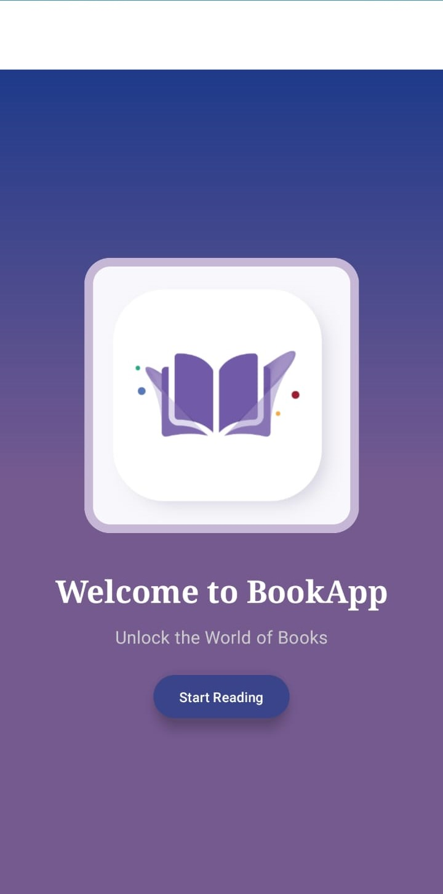
  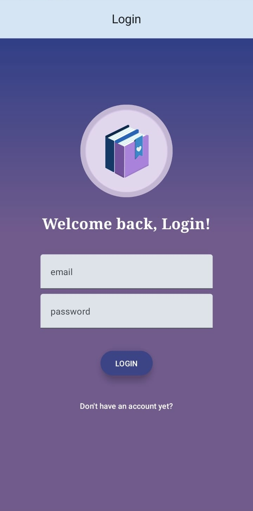

 

  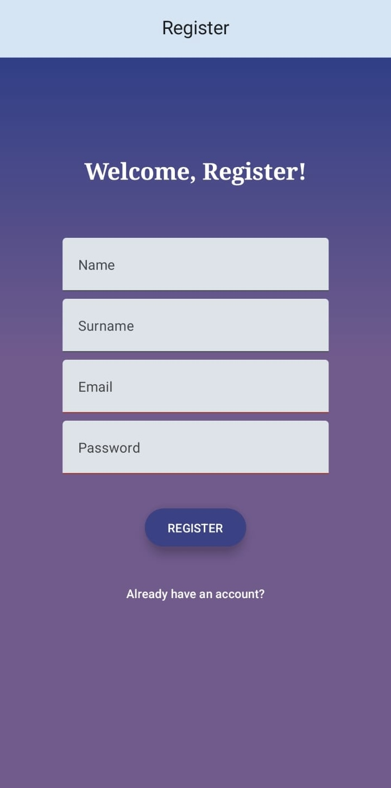
  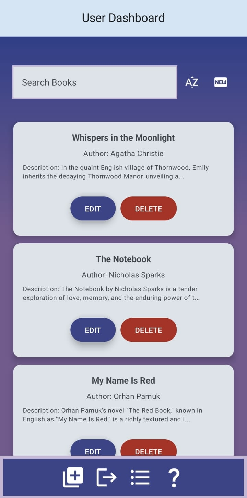

 

  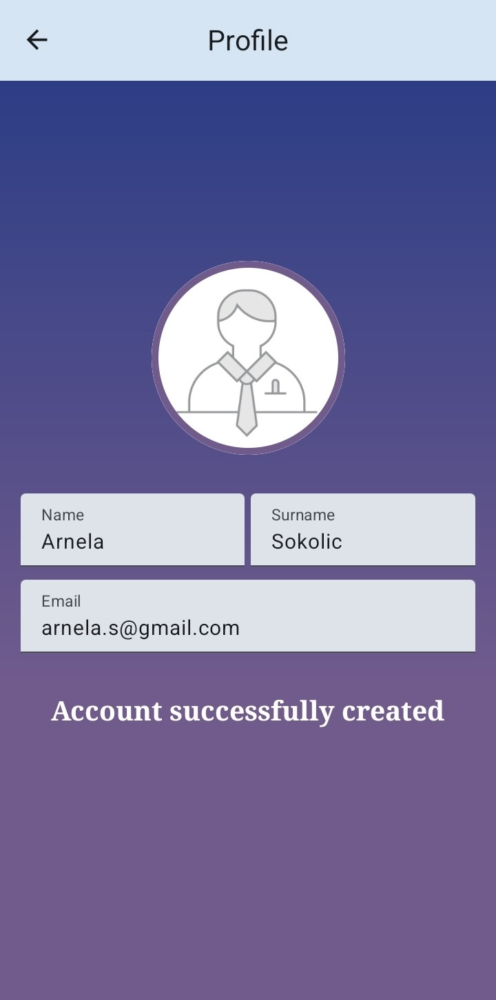
  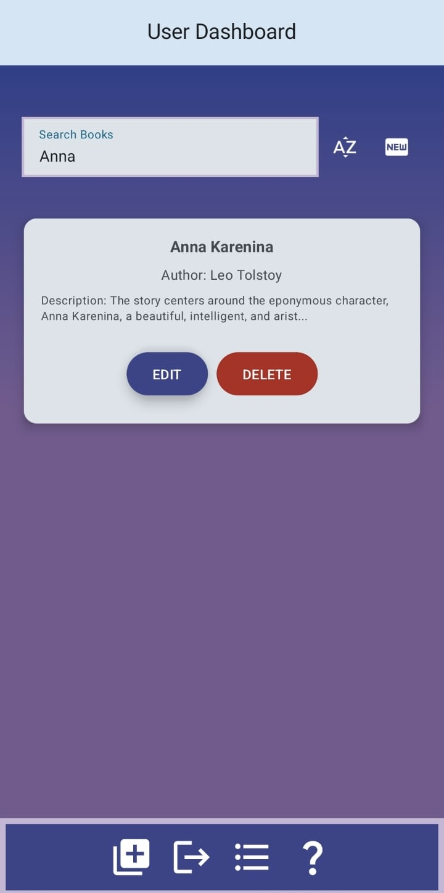

 

  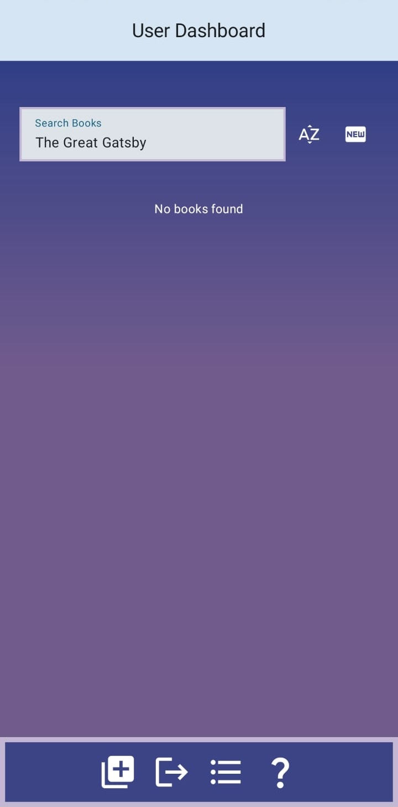
  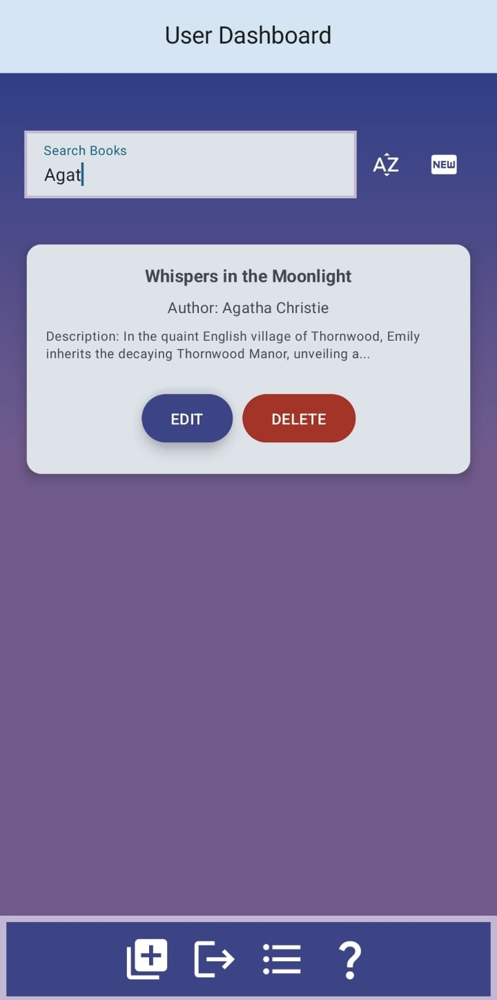

 

  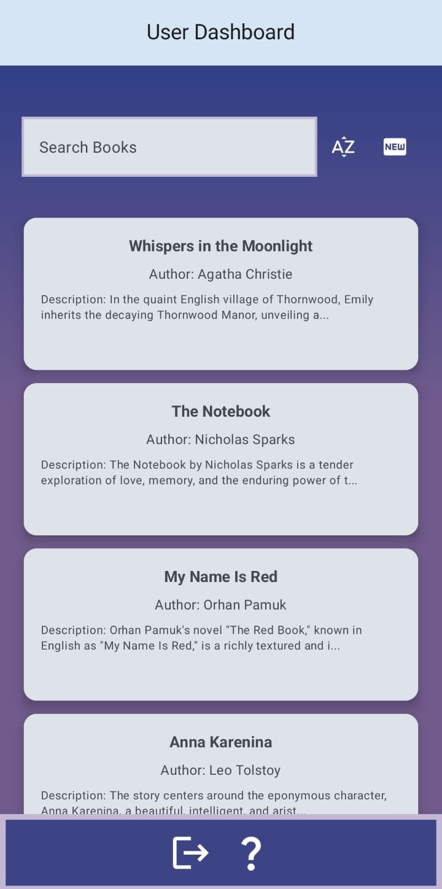
  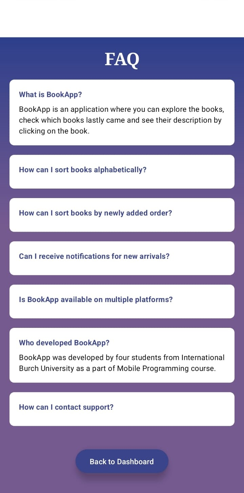

 

  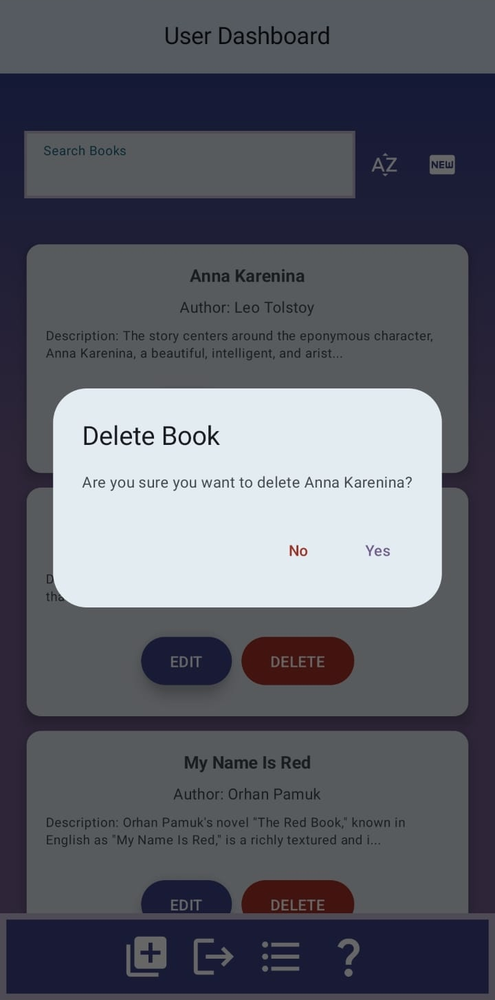
  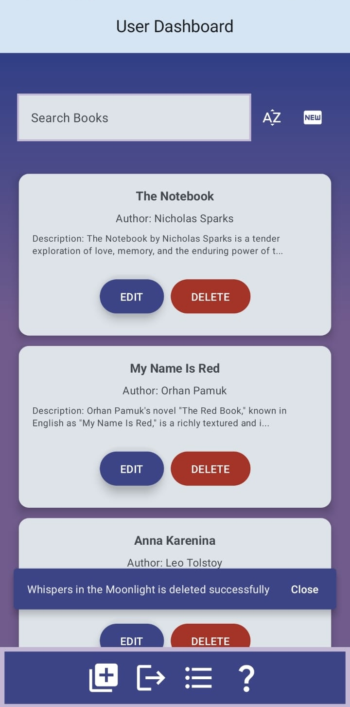

 

  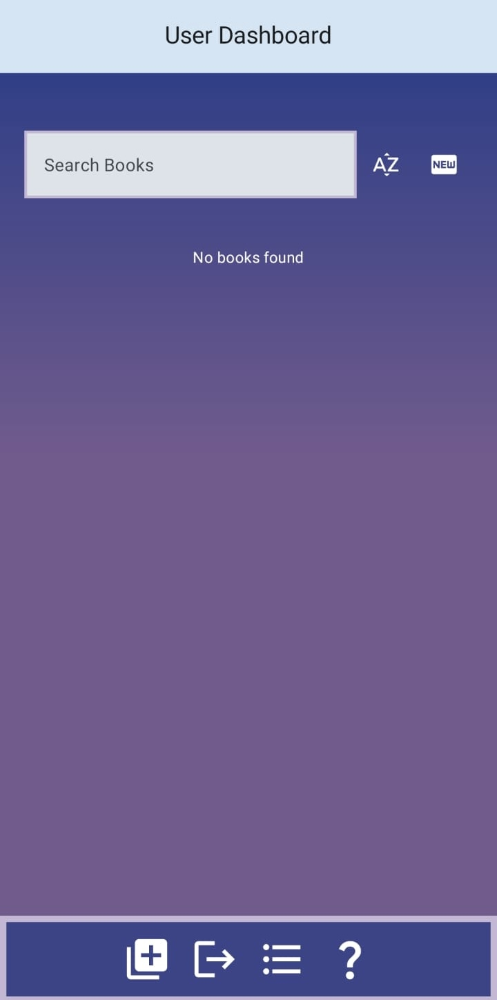
  

 

  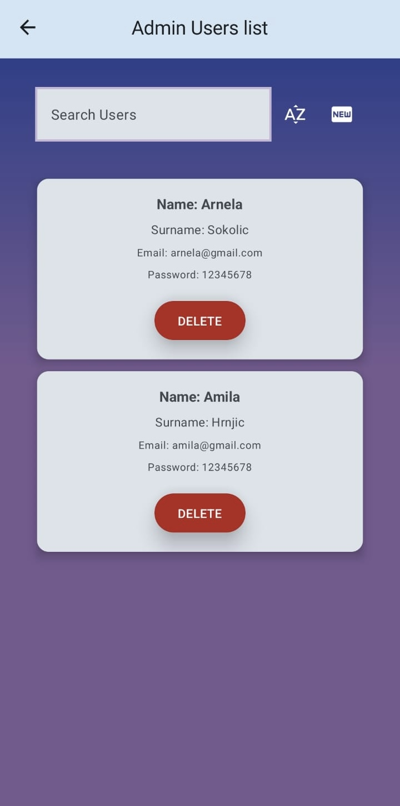
  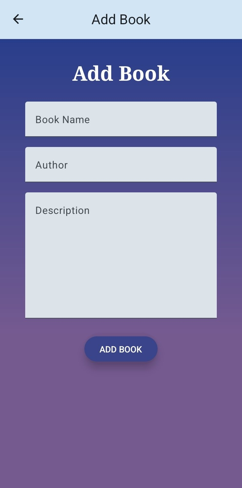

